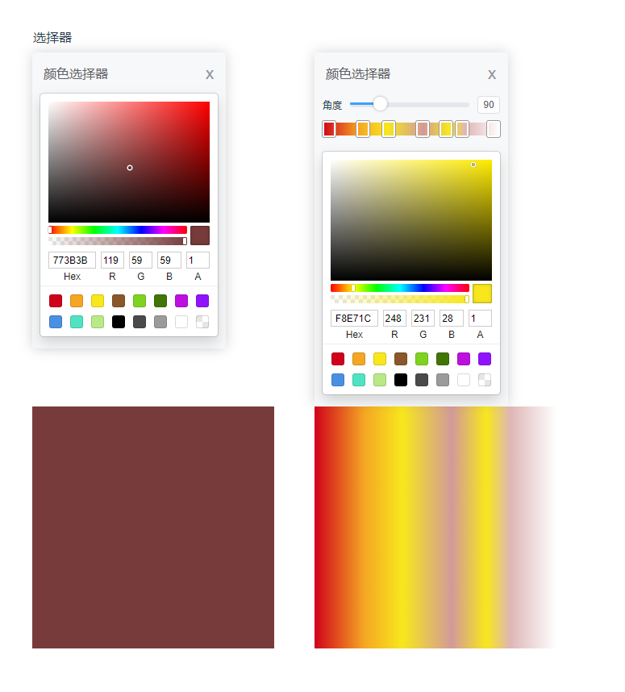

# vue2-color-picker-gradient

[](https://www.npmjs.com/package/vue2-color-picker-gradient)
[](https://www.npmjs.com/package/vue2-color-picker-gradient)
[](https://github.com/CNLHB/vue2-color-picker-gradient/stargazers)  
Color Pickers for  ColorPickerGradient, Chrome & more with Vue.js(vue2.x).  
欢迎点个star🎉🎉🎉  



## [Live demo](https://cnlhb.github.io/vue2-color-picker-gradient/build/index.html)

## Installation

### NPM

```bash
$ npm install vue2-color-picker-gradient
```

### ES6

```
import Vue from 'vue'
import ColorPickerGradient from 'vue2-color-picker-gradient'
Vue.use(ColorPickerGradient)

```

or

```

import ColorPicker from 'vue2-color-picker-gradient'
export default {
  name: 'App',
  components: {
    ColorPicker,
  },
}

```

## Props

### Props of ColorPicker

| Name             | Type    | Default                                                                  | Description                  |
| ---------------- | ------- | ------------------------------------------------------------------------ | ---------------------------- |
| type             | string  | linear or gradient                                                       | Color selector type          |
| disabledColorDeg | boolean | false                                                                    | Disable angle                |
| pDeg             | number  | 90                                                                       | Default angle                |
| pColor           | object  | {hex: '#000000',rgba: { r: 0, g: 0, b: 0, a: 1 },color: 'rgba(0,0,0,1)'} | Default color                |
| pColors          | Array   | [{...pColor,pst:0},{...pColor,pst:100}]                                  | Gradient Default color Array |
| showClose        | boolean | true                                                                     | true or false                |
| closeOnClickBody | boolean | false                                                                    | click on body close picker   |
| titleConfig      | object  | {text:"颜色选择器",show: true}                                           |                              |
|                  |         |                                                                          |                              |
## Events

| Name   | Params | Description                 |
| ------ | ------ | --------------------------- |
| @changeColor |{ style, colors, deg, color }    | color chang callback |
| @onClose |    | picker hide callback |

### example

```vue
<template>
  <div id="app">
    <div class="select" @click="showPicker">选择器</div>
    <div class="color_poick">
      <ColorPicker
        v-model="isShowColorPicker"
        type="linear"
        @changeColor="changeColor"
        @onClose="onClosePicker"
        :pDeg="90"
        :pColor="pColor"
        :pColors="pColors"
        :showClose="true"
        :closeOnClickBody="false"
      />
      <ColorPicker
        v-model="isShowColorPicker1"
        type="gradient"
        @changeColor="changeColor1"
        @onClose="onClosePicker1"
        :pDeg="90"
        :pColor="pColor"
        :pColors="pColors"
        :showClose="true"
        :closeOnClickBody="false"
      />
    </div>
    <div style="display: flex;">
      <div class="box_xxx" :style="style"></div>
      <div class="box_xxx box1" :style="style1"></div>
    </div>
  </div>
</template>

<script>
import ColorPicker from './components/vue2-color-picker.vue'

export default {
  name: 'App',
  components: {
    ColorPicker,
  },
  data() {
    return {
      isShowColorPicker: true,
      isShowColorPicker1: true,
      style: '',
      style1: '',
      titleConfig: {
        show: true,//控制顶部文字 关闭按钮 显隐
        text:'颜色选择器'//顶部文字
      },
      pDeg: 60,
      pColor: {
        hex: '#194d33',
        hex8: '#194d33',
        hsl: { h: 150, s: 0.5, l: 0.2, a: 1 },
        hsv: { h: 150, s: 0.66, v: 0.3, a: 1 },
        rgba: { r: 25, g: 77, b: 51, a: 1 },
        a: 1,
        color: 'rgba(0,0,0,1)',
      },
      pColors: [
        {
          color: 'rgba(255, 255, 255, 1)',
          hex: '#ffffff',
          rgba: { r: 255, g: 255, b: 255, a: 1 },
          pst: 100,
        },
        {
          color: 'rgba(0, 0, 0, 1)',
          hex: '#000000',
          rgba: { r: 0, g: 0, b: 0, a: 1 },
          pst: 0,
        },
      ],
    }
  },
  methods: {
    changeColor({ style, colors, deg, color }) {
      console.log(style, colors, deg, color)
      this.style = `background: ${color.color}`
    },
    showPicker() {
      this.isShowColorPicker = true
      this.isShowColorPicker1 = true
    },
    onClosePicker() {},
    changeColor1({ style, colors, deg, color }) {
      console.log(style, colors, deg, color)
      this.style1 = `background: ${style}`
    },
    showPicker1() {
      this.isShowColorPicker1 = true
    },
    onClosePicker1() {},
  },
  watch: {},
}
</script>

<style lang="scss">
#app {
  font-family: Avenir, Helvetica, Arial, sans-serif;
  -webkit-font-smoothing: antialiased;
  -moz-osx-font-smoothing: grayscale;
  text-align: center;
  color: #2c3e50;
  margin-top: 60px;
}
.select {
  height: 30px;
  width: 50px;
}
.color_poick {
  display: flex;
  justify-content: space-between;
  width: 590px;
}
.box_xxx {
  width: 300px;
  height: 300px;
}
.box1{
  margin-left: 50px;
}
</style>


```

## Local setup

### Compiles and hot-reloads for development

```
yarn serve
```

### Compiles and minifies for lib

```
yarn lib
```

### Lints and fixes files

```
yarn lint
```


### Customize configuration

See [Configuration Reference](https://cli.vuejs.org/config/).
